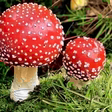

# Colorization

Coloring is the process of adding reasonable color information to monochrome photos or videos. At present, digital coloring of black and white visual data is a key task in many fields such as advertising and film industry, photography technology or artist assistance. Although important progress has been made in this field, automatic image shading is still a challenge. Shading is a highly uncertain problem. It is necessary to map a real gray image to a three-dimensional color image, which has no unique solution. Colorization algorithm takes the potential uncertainty in the coloring problem as the classification task, and uses class rebalancing during training to increase the color diversity in the results. The algorithm uses ImageNet dataset for training, and achieves better results than other shading models.

## Pretrained model

### Colorization Model trained by MindSpore

| model        | ckpt                                                                              |
|:-------------|:----------------------------------------------------------------------------------|
| Colorization | [ckpt](https://download.mindspore.cn/vision/colorization/Colorization_model.ckpt) |

## Training Parameter description

| Parameter                          | Default          | Description                                        |
|:-----------------------------------|:-----------------|:---------------------------------------------------|
| device_target                      | GPU              | Device type                                        |
| device_id                          | 0                | Device ID                                          |
| image_dir                          | ../dataset/train | Path of training dataset                           |
| checkpoint_dir                     | ../checkpoints   | Path to save checkpoint                            |
| test_dirs                          | ../images        | Path to save images                                |
| resource                           | ./resources/     | Path to Prior knowledge                            |
| shuffle                            | True             | Whether to have the data reshuffled at every epoch |
| num_epochs                         | 200              | The number of epochs to run                        |
| batch_size                         | 256              | The size of batch size                             |
| num_parallel_workers               | 1                | Number of parallel workers                         |
| log_path                           | ./log.txt        | Path to log                                        |
| learning_rate                      | 0.5e-4           | Model learning rate                                |
| save_step                          | 200              | step size for saving trained models                |

## The overall structure of the project

```text
└──Colorization
    ├──readme.md
    ├──Colorization.ipynb
    ├──src
        ├──losses
            ├──loss.py                          # Loss cell.
        ├──models
            ├──colormodel.py                    # The connector of network, loss and optimizer.
            ├──model.py                         # Network.
        ├──process_datasets
            ├──data_generator.py                # Create the Colorization dataset.
        ├──resources
            └──prior_probs.npy                  # Color prior knowledge.file
            └──pts_in_hull.npy                  # Represent the points in the quantized ab space.
        ├──utils
            └──utils.py                         # Common image processing functions and tool functions.
        ├──infer.py                             # Test the performance in the specified directory.
        ├──train.py                             # Build and train model.
    ├──dataset
        ├── ILSVRC2012_devkit_t12.tar.gz
        ├── train/
        └── val/
    ├──images                                   # Used to save intermediate training result images.
    ├──checkpoints                              # Used to save training model files.
```

## Example

Here, how to use Colorization model will be introduced as following.

### Dataset

First of all, we recommend using the [ImageNet dataset](https://image-net.org/) for training. The directory structure of the dataset is described as follows:  

```text
.dataset/
    ├── ILSVRC2012_devkit_t12.tar.gz
    ├── train/
    └── val/
```

### Train Model

After you have all the datasets ready, run the train.py to start to train the model.

```shell
python train.py --batch_size 128 --learning_rate 0.5e-4
```

output:

```text
14it [00:11,  1.63it/s][1/200]  Loss_net:: 6.1110
15it [00:12,  1.65it/s][1/200]  Loss_net:: 5.1661
16it [00:13,  1.65it/s][1/200]  Loss_net:: 4.1757
```

When the training starts, the program automatically created ```images``` and ```checkpoints``` directories, using the former to save test results and the latter to save model files.
Subjective judgment can be made based on the test results in ```images``` to select an appropriate model for the following model inferring.

### Infer Model

After training, you can use your own image to test your model. Select the model file you think is best from the ```checkpoints``` directory and select the image folder that you want to test, then run ```infer.py``` to do inference.  
If you use a pre-trained model for inference, you can use the following command.

```shell
python infer.py --img_path ../dataset/val --infer_dirs ../dataset/output --ckpt_path ../checkpoints/Colorization_model.ckpt
```

### Result

The following is the colorization result of the picture.



